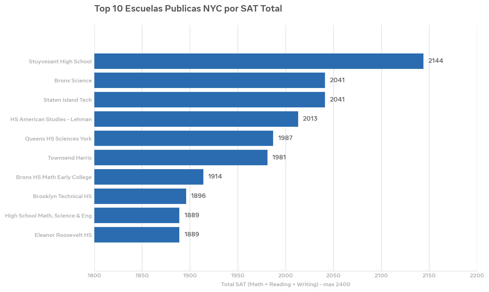
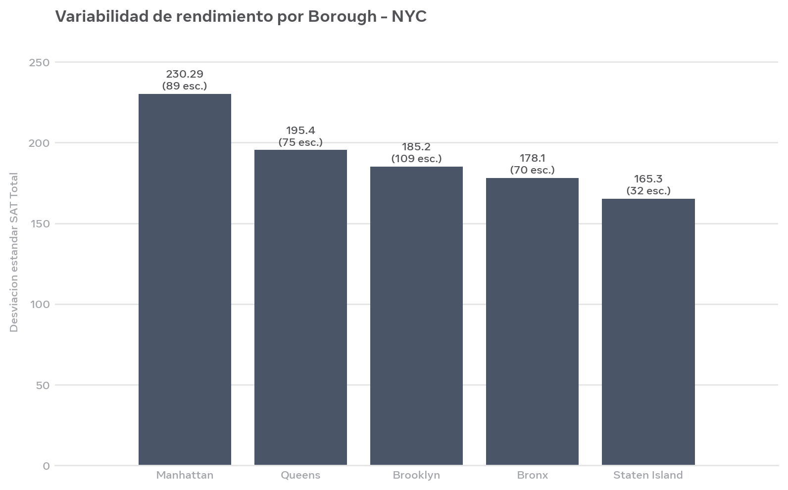

Análisis de Escuelas Públicas de NYC y Resultados SAT
<p align="center">
  
</p>
Resumen del proyecto
Análisis de 444 escuelas públicas de Nueva York para determinar cómo los recursos escolares, tasa de graduación y entorno socioeconómico impactan en los puntajes SAT.
Dataset
Fuente: NYC Open Data - Escuelas Públicas
Registros: 444 escuelas
Variables clave: puntaje SAT, presupuesto por estudiante, tasa de graduación, tamaño de clases
Metodología
```sql
SELECT 
  school_name,
  AVG(sat_score) AS avg_sat,
  graduation_rate
FROM schools
WHERE sat_score IS NOT NULL
GROUP BY school_name
ORDER BY avg_sat DESC
LIMIT 10;
```
Hallazgos principales
Correlación entre recursos y resultados SAT
Top 10 escuelas con mejores resultados identificados
Análisis de variabilidad de rendimiento por Borough
Visualización
Top 10 Escuelas Públicas NYC por SAT Total

Variabilidad de rendimiento por Borough - NYC

Stack
SQL (WHERE, GROUP BY, AVG, ORDER BY, LIMIT)
Python (Pandas, Matplotlib, Seaborn)
Jupyter Notebook
Estructura del repositorio
```
├── data/
├── queries/
├── visuals/
│   ├── cover.jpg
│   ├── top_10_escuelas.png
│   └── variabilidad_borough.png
├── analisis_escuelas.ipynb
└── README.md
```
Autor
Enrique Talavera - LinkedIn | GitHub
